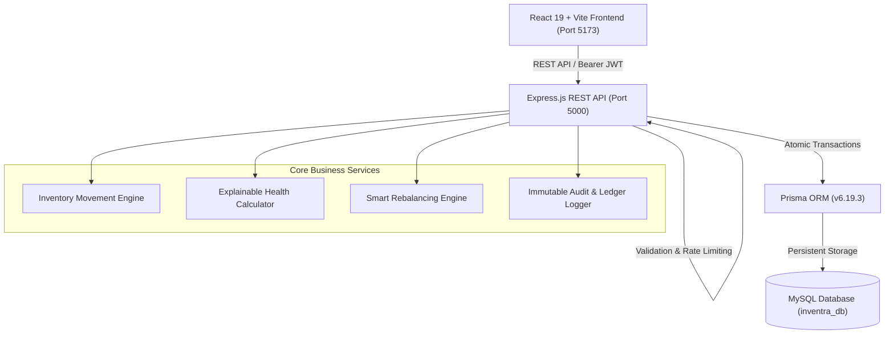

# INVENTRA — Enterprise Inventory Management & Operational Map System

<div align="center">


**Inventory as a live operational map. Zero mock numbers. 100% custody tracking.**

[Explore Features](#-core-features) • [Architecture](#-system-architecture) • [Getting Started](#-getting-started) • [API Reference](#-api-endpoints) • [Demo Logins](#-demo-credentials)

</div>

---

## 🌟 Overview

**INVENTRA** is an enterprise-grade, transactional inventory management platform designed to replace disconnected registers, WhatsApp threads, and static Excel spreadsheets with real-time zone tracking, bin-level accuracy, and end-to-end stock custody.

Built around the operational principle of **SEE → UNDERSTAND → ACT**, every quantity in INVENTRA is anchored to an immutable ledger transaction with a timestamp, audit reason, and responsible user.

---

## 🚀 Core Features

### 1. 🧭 Live Interactive Inventory Map
- **Hierarchical Physical Explorer:** Drill down seamlessly from **Warehouse → Zone → Rack → Shelf → Bin**.
- **Real-Time Bin Occupancy:** Visual color-coded capacity indicators (*Healthy*, *Watch/Risk*, *Depleted*, *Overstock*).
- **Physical Custody Audit:** Instant inspection of items stored inside any individual bin.

### 2. ⚡ Top Quick Actions Bar
- Prominently situated at the top of the dashboard for instant, 1-click access:
  - 📥 **New Receipt** — Log inbound supplier consignments
  - 📤 **New Delivery** — Process outbound customer dispatches
  - 🔄 **New Internal Transfer** — Move stock across zones & warehouses
  - ⚖️ **Adjust Stock** — Reconcile physical cycle count variances
  - ➕ **Add Product** — Register new catalog items & SKUs

### 3. 📊 Real-Time Dashboard & Health Engine
- **Live Business KPIs:** Total Inventory Value (`₹L`), Total Units, Risk Stock, Depleted Items, Pending Inbounds/Outbounds.
- **Explainable Stock Health:** Rule-based analytics computing **Daily Usage**, **Days Remaining**, and **Reorder Safety Buffers**.
- **Action Center:** Context-rich warnings (*"Run-out estimated in 6 days — Order 82 units"*).
- **Today's Inventory Velocity:** Flow stages tracking items *Received → Stored → Reserved → Moving → Delivered*.

### 4. 🧬 Digital Stock DNA & Stock Journey Timeline
- **QR Code Verification:** Scan product QR codes on mobile/terminals for instant physical bin allocation.
- **Audit Journey Timeline:** Complete chronological ledger for every product showing Receipts, Internal Transfers, Customer Dispatches, and Physical Adjustments with dynamic running balance.

### 5. 📥 Transactional Inbound Receipts
- Purchase order intake with scheduled delivery dates and carrier notes.
- **Atomic Validation:** One-click receipt validation increments physical stock and logs an immutable ledger entry.

### 6. 📤 Outbound Deliveries with Shortage Prevention
- Customer dispatch order processing with line-item picking, packing, and shipping.
- **Automated Shortage Check:** Prevents negative inventory anomalies; halts dispatches if stock is insufficient.

### 7. 🔄 Internal Transfers & Smart Rebalancing
- Move materials between racks, zones, and facilities with 100% total company stock conservation.
- **Smart Rebalancing Engine:** Detects location imbalances (e.g. Storage Zone A overstocked while Regional Facility is depleted) and suggests actionable transfers.

### 8. 🔍 Stock Adjustments & Physical Cycle Counts
- Cycle count audit tool for physical reconciliation.
- Pre-defined variance reasons: `DAMAGE`, `SPOILAGE`, `THEFT`, `FOUND_STOCK`, and `DATA_CORRECTION`.
- Auto-generates ledger corrections while keeping historical balances untampered.

### 9. 🛡️ Immutable Stock Ledger & Move History
- Append-only transactional ledger — history is cryptographically preserved and cannot be overwritten.
- Dual-view **Move History** (Data Table or Interactive Visual Timeline).
- One-click **CSV Audit Export**.

### 10. ⚡ Global Omnisearch (⌘K / Ctrl+K)
- Debounced full-text search indexing products, barcodes, SKUs, warehouses, receipts, deliveries, and transfers.

---

## 🏗️ System Architecture



---

## 🛠️ Tech Stack

| Layer | Technologies |
| :--- | :--- |
| **Frontend** | React 19, Vite 6, React Router DOM 7, Lucide Icons, Recharts |
| **Styling** | Custom Vanilla CSS Design System (Dark mode, glassmorphism, responsive tokens) |
| **Backend** | Node.js, Express.js 5, CORS, Dotenv, Sliding Window Rate Limiting |
| **Database & ORM** | MySQL 8.0, Prisma ORM 6.19 (`relationMode = "prisma"`) |
| **Security & Auth** | JSON Web Tokens (JWT), Bcrypt password hashing, Role-Based Access Control (RBAC) |

---

## 📂 Project Structure

```
Inventra/
├── prisma/
│   └── schema.prisma            # 21 Models: User, Role, Product, Stock, Receipt, Delivery, Transfer, Ledger...
├── server/
│   ├── controllers/             # Express route controllers (auth, product, receipt, delivery, dashboard, etc.)
│   ├── lib/
│   │   └── prisma.js            # Prisma client singleton
│   ├── middleware/              # JWT auth and sliding-window rate limiters
│   ├── routes/                  # Express API route modules
│   ├── seed/
│   │   └── initSeed.js          # Automatic database seed loader
│   ├── services/
│   │   ├── inventory.service.js # Atomic Prisma transactions for all movements
│   │   ├── health.service.js    # Rule-based explainable inventory health
│   │   ├── smartTransfer.service.js # Location rebalancing analyzer
│   │   ├── stock.service.js     # Stock journey & ledger queries
│   │   ├── alert.service.js     # Dynamic alert synchronization
│   │   └── audit.service.js     # Append-only audit logger
│   ├── server.js                # Server entry point (Port 5000)
│   └── test_flow.js             # Automated 8-step verification test runner
├── src/
│   ├── components/              # Sidebar, TopBar, SearchModal
│   ├── context/                 # AuthContext (JWT session management)
│   ├── pages/                   # Dashboard, Products, Receipts, Deliveries, Transfers, Adjustments, Ledger, Map...
│   ├── services/
│   │   └── api.js               # Centralized frontend API client
│   ├── App.jsx                  # Application router & layout shell
│   ├── index.css                # Enterprise design system CSS
│   └── main.jsx                 # Vite application mount
├── vite.config.js               # Vite config with backend proxy (/api -> :5000)
└── package.json
```

---

## 🚦 Getting Started

### Prerequisites
- [Node.js](https://nodejs.org/) (v18.x or higher)
- [MySQL](https://www.mysql.com/) (or XAMPP with MySQL running on port 3306)
- Git

### 1. Clone Repository & Install Dependencies
```bash
git clone https://github.com/shreyansh-hacker/Inventra.git
cd Inventra
npm install
```

### 2. Configure Environment Variables
Create a `.env` file in the root directory:
```env
# Database Connection
DATABASE_URL="mysql://root:@localhost:3306/inventra_db"

# Server Configuration
PORT=5000
NODE_ENV=development

# Authentication
JWT_SECRET="inventra_jwt_super_secret_enterprise_key_2026"
```

### 3. Setup Database & Prisma
In your MySQL management tool (e.g. phpMyAdmin or MySQL CLI), ensure the database exists:
```sql
CREATE DATABASE IF NOT EXISTS `inventra_db`;
```

Generate the Prisma client and push the schema:
```bash
npx prisma generate
npx prisma db push
```

### 4. Start the Backend API Server
```bash
node server/server.js
```
*The server will start on `http://localhost:5000` and automatically seed initial catalogs, warehouses, and users.*

### 5. Start the Vite Frontend Development Server
In a new terminal window:
```bash
npm run dev
```
Open **`http://localhost:5173`** in your browser.

---

## 🧪 Automated 8-Step Flow Verification

INVENTRA includes a built-in verification suite testing the entire transactional inventory lifecycle:
1. Product creation with `0` initial stock
2. Inbound receipt of `100 kg`
3. Internal transfer of `20 kg` (verifying company stock conservation)
4. Outbound customer delivery of `20 kg`
5. Physical count adjustment (damaged goods deduction)
6. Stock Journey timeline audit trail
7. Immutable Stock Ledger verification
8. Dashboard live calculation accuracy

Run the test suite anytime:
```bash
node server/test_flow.js
```

---

## 🔑 Demo Credentials

| Role | Email | Password | Access Level |
| :--- | :--- | :--- | :--- |
| **Inventory Administrator** | `yash@inventra.internal` | `admin@123` | Full access to all operations, settings, and audits |
| **Warehouse Operations Manager** | `Garage.sharma@inventra.internal` | `manager@123` | Stock movements, receipts, deliveries, and transfers |
| **Inventory Auditor** | `yash.audichya@inventra.internal` | `auditor@123` | Immutable stock ledger, reports, and cycle count reviews |

---

## 📡 API Endpoints

| Method | Endpoint | Description |
| :--- | :--- | :--- |
| `POST` | `/api/auth/login` | Authenticate user & issue JWT |
| `POST` | `/api/auth/register` | Register new staff member |
| `GET` | `/api/dashboard/summary` | Real-time counts, valuations & throughput |
| `GET` | `/api/dashboard/health` | Health distribution & explainable action queue |
| `GET` | `/api/products` | Retrieve catalog with stock breakdowns & filters |
| `POST` | `/api/products` | Create product with auto-generated barcode |
| `GET` | `/api/products/:id` | Detailed product view with Stock Journey timeline |
| `GET` | `/api/receipts` | Inbound purchase orders |
| `POST` | `/api/receipts/:id/validate`| Atomically receive stock into warehouse location |
| `GET` | `/api/deliveries` | Outbound customer shipments |
| `POST` | `/api/deliveries/:id/validate`| Validate and decrement stock with shortage protection |
| `GET` | `/api/transfers` | Internal transfer records |
| `GET` | `/api/transfers/suggestions` | Smart rebalancing suggestions |
| `POST` | `/api/transfers/suggestions/approve` | Approve & execute smart rebalancing |
| `GET` | `/api/adjustments` | Stock reconciliation entries |
| `POST` | `/api/adjustments` | Record physical cycle count difference |
| `GET` | `/api/ledger` | Immutable audit ledger log |
| `GET` | `/api/movements` | Chronological movement feed |
| `GET` | `/api/inventory-map` | Physical warehouse topology & bin occupancy |
| `GET` | `/api/search?q={query}` | Global omnisearch across all entities |

---

## 📄 License
This project is licensed under the MIT License — see the [LICENSE](LICENSE) file for details.

<div align="center">
  <sub>Built with ❤️ by the INVENTRA Engineering Team.</sub>
</div>
