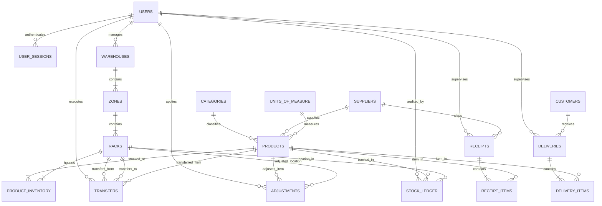

# INVENTRA — MySQL Database Architecture & Setup Guide

This directory contains the production-grade, relational MySQL database schema, initial seed data, views, and stored procedures engineered specifically for **INVENTRA** (Inventory Management System).

---

## 🏗 Database Architecture Diagram (ERD)



---

## 📁 Files Included

| File | Purpose |
|---|---|
| [`schema.sql`](file:///c:/Users/Yash%20rathore/Desktop/Inventra/database/schema.sql) | Complete DDL script creating all 13 core tables, foreign keys, indexes, and constraints. |
| [`seed.sql`](file:///c:/Users/Yash%20rathore/Desktop/Inventra/database/seed.sql) | DML script inserting all realistic records from `demoData.js` (users, products, receipts, deliveries, etc.). |
| [`views_and_procedures.sql`](file:///c:/Users/Yash%20rathore/Desktop/Inventra/database/views_and_procedures.sql) | Analytics views (`v_product_stock_summary`, `v_dashboard_kpis`) & atomic stored procedures. |
| [`init_database.sql`](file:///c:/Users/Yash%20rathore/Desktop/Inventra/database/init_database.sql) | Master one-click initialization script executing all files in sequence. |
| [`db.js`](file:///c:/Users/Yash%20rathore/Desktop/Inventra/database/db.js) | Production Node.js / Express connection pool module with `mysql2/promise`. |
| [`.env.example`](file:///c:/Users/Yash%20rathore/Desktop/Inventra/database/.env.example) | Example environment credentials. |

---

## 🚀 Quick Setup Instructions

### Option 1: MySQL Command Line (CLI)

1. Open your terminal or PowerShell.
2. Run the master script into your MySQL server:
```bash
mysql -u root -p < database/schema.sql
mysql -u root -p inventra_db < database/seed.sql
mysql -u root -p inventra_db < database/views_and_procedures.sql
```
*Or execute everything inside the MySQL shell:*
```sql
SOURCE c:/Users/Yash rathore/Desktop/Inventra/database/schema.sql;
SOURCE c:/Users/Yash rathore/Desktop/Inventra/database/seed.sql;
SOURCE c:/Users/Yash rathore/Desktop/Inventra/database/views_and_procedures.sql;
```

### Option 2: MySQL Workbench or DBeaver

1. Open **MySQL Workbench** or **DBeaver** and connect to your local MySQL instance.
2. Go to **File -> Open SQL Script...** and select [`schema.sql`](file:///c:/Users/Yash%20rathore/Desktop/Inventra/database/schema.sql).
3. Execute the script (Click the ⚡ Lightning Bolt icon).
4. Repeat for [`seed.sql`](file:///c:/Users/Yash%20rathore/Desktop/Inventra/database/seed.sql) and [`views_and_procedures.sql`](file:///c:/Users/Yash%20rathore/Desktop/Inventra/database/views_and_procedures.sql).

### Option 3: phpMyAdmin / XAMPP / WampServer

1. Start Apache and MySQL in the XAMPP Control Panel.
2. Open `http://localhost/phpmyadmin` in your browser.
3. Click the **Import** tab at the top.
4. Choose [`schema.sql`](file:///c:/Users/Yash%20rathore/Desktop/Inventra/database/schema.sql) and click **Go**.
5. Select the newly created `inventra_db` from the left sidebar.
6. Import [`seed.sql`](file:///c:/Users/Yash%20rathore/Desktop/Inventra/database/seed.sql) and [`views_and_procedures.sql`](file:///c:/Users/Yash%20rathore/Desktop/Inventra/database/views_and_procedures.sql).

---

## 📊 Core Tables Summary

| Table | Records Stored | Key Features |
|---|---|---|
| `users` & `roles` | Staff, Admin, Managers, Clerks | RBAC permissions, encrypted password hashes, avatar initials |
| `warehouses` | Facilities (Main Warehouse, DC) | Address, manager foreign key, overall storage capacities |
| `zones` & `racks` | Sub-locations (SZ-A, PF, RD, MF, CS) | Zone codes, rack level capacities and status tracking |
| `products` | Catalog (Steel rods, Cables, Chairs, etc.) | SKU, EAN-13 barcode, category, cost/selling price, reorder points |
| `product_inventory` | Live stock per rack | `on_hand`, `reserved`, `damaged`, generated `available` column |
| `receipts` & `receipt_items` | Inbound orders (WH/IN/0001...) | Supplier linking, expected vs received stock, discrepancy delta |
| `deliveries` & `delivery_items` | Outbound shipments (WH/OUT/0001...) | Customer linking, staged states: picking, packing, delivered |
| `transfers` | Internal warehouse shifts (WH/INT/0001...) | From Rack to To Rack, in-transit state management |
| `adjustments` | Cycle counts & physical audits | System qty vs counted qty, reason classifications |
| `stock_ledger` | Double-entry inventory ledger | Immutable before/change/after tracking on every single transaction |
| `move_history` | Human-readable audit log | User tracking, timestamp, and visual movement tags |
| `alerts` | Actionable notifications | Critical, warning, and info level alerts tied to products & racks |
